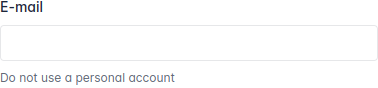
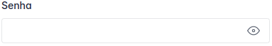
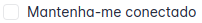
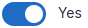

<a href="https://fmd.ag" target="_blank"></a>

# Admix Components

<a href="https://packagist.org/packages/agenciafmd/admix-components"></a>
<a href="https://packagist.org/packages/agenciafmd/admix-components"></a>
<a href="https://packagist.org/packages/agenciafmd/admix-components"></a>

Admix components is a pack of components based on [Blade UI Kit](https://blade-ui-kit.com/)
using [Boostrap](https://getbootstrap.com/) instead of Tailwind. [Tabler](https://tabler.github.io/) is our base for
layout.

## Requirements

- Laravel 9
- PHP 8.1

## Features

- [Buttons](#buttons)
- [Cards](#cards)
- [Forms](#forms)

## Documentation

- [Getting Started](#getting-started)
- [Blade Components](#blade-components)

### Getting Started

Install the package by running

```console
composer require agenciafmd/admix-components
```

### Blade Components

We have some components that you can use in your project.

### Buttons

### Cards

### Forms

By default, we use livewire to handle with forms and inputs and validations is already included.

#### Input



Basic usage

```html

<x-form.input name="email"/>
```

This will output the following HTML

```html
<input name="email" type="text" id="name" wire:model.lazy="email" class="form-control">
```

Accepted properties:

- `type` : the input type. eg. `text`, `email`
- `label` : The label of the input
- `wire:model` : The wire model of the input
- `hint` : A helper text for the input
- `value` : The value of the input when **not** using `wire:model`

Full component

```html

<x-form.input type="email"
              name="email"
              :hint="__('Do not use a personal account')"
              :label="__('E-mail')"
/>
```

Output

```html
<label for="email" class="form-label">E-mail</label>
<input name="email" type="email" id="email" wire:model.lazy="email" class="form-control">
<small class="form-hint">Do not use a personal account</small>
```

#### Password



Basic usage

```html

<x-form.password name="password"
                 :label="__('Password')"
/>
```

This will output the following HTML

```html
<label for="password" class="form-label">Password</label>
<div class="input-group input-group-flat " x-data="{ isPassword: true }">
    <input name="password" :type="isPassword ? 'password' : 'text'" id="password" wire:model.lazy="password"
           class="form-control" type="password">
    <span class="input-group-text">
        <a href="#" @click="isPassword = !isPassword" :class="isPassword ? 'd-block' : 'd-none'"
           class="link-secondary d-block" data-bs-toggle="tooltip" aria-label="Mostrar senha"
           data-bs-original-title="Mostrar senha">
            <!-- Download SVG icon from http://tabler-icons.io/i/eye -->
            <svg xmlns="http://www.w3.org/2000/svg" class="icon" width="24" height="24" viewBox="0 0 24 24"
                 stroke-width="2" stroke="currentColor" fill="none" stroke-linecap="round" stroke-linejoin="round">
                <path stroke="none" d="M0 0h24v24H0z" fill="none"></path>
                <path d="M12 12m-2 0a2 2 0 1 0 4 0a2 2 0 1 0 -4 0"></path>
                <path d="M22 12c-2.667 4.667 -6 7 -10 7s-7.333 -2.333 -10 -7c2.667 -4.667 6 -7 10 -7s7.333 2.333 10 7"></path>
            </svg>
        </a>
        <a href="#" @click="isPassword = !isPassword" :class="!isPassword ? 'd-block' : 'd-none'"
           class="link-secondary d-none" data-bs-toggle="tooltip" aria-label="Ocultar senha"
           data-bs-original-title="Ocultar senha">
            <!-- Download SVG icon from http://tabler-icons.io/i/eye-off -->
            <svg xmlns="http://www.w3.org/2000/svg" class="icon" width="24" height="24" viewBox="0 0 24 24"
                 stroke-width="2" stroke="currentColor" fill="none" stroke-linecap="round" stroke-linejoin="round">
                <path stroke="none" d="M0 0h24v24H0z" fill="none"></path>
                <path d="M10.585 10.587a2 2 0 0 0 2.829 2.828"></path>
                <path d="M16.681 16.673a8.717 8.717 0 0 1 -4.681 1.327c-3.6 0 -6.6 -2 -9 -6c1.272 -2.12 2.712 -3.678 4.32 -4.674m2.86 -1.146a9.055 9.055 0 0 1 1.82 -.18c3.6 0 6.6 2 9 6c-.666 1.11 -1.379 2.067 -2.138 2.87"></path>
                <path d="M3 3l18 18"></path>
            </svg>
        </a>
    </span>
</div>
```

#### Checkbox



Basic usage

```html

<x-form.checkbox name="remember"
                 :label="__('Remember me')"
/>
```

This will output the following HTML

```html
<label class="form-check">
    <input name="remember" type="checkbox" id="remember" wire:model.lazy="remember" class="form-check-input">
    <span class="form-check-label">Remember me</span>
</label>
```

We can customize the checkbox to act like a switch

```html

<x-form.checkbox name="can_notify"
                 class="form-switch form-switch-lg"
                 :label-on="__('Yes')"
                 :label-off="__('No')"
/>
```



## License

Admix Components is open-sourced software licensed under [the MIT license](LICENSE.md).